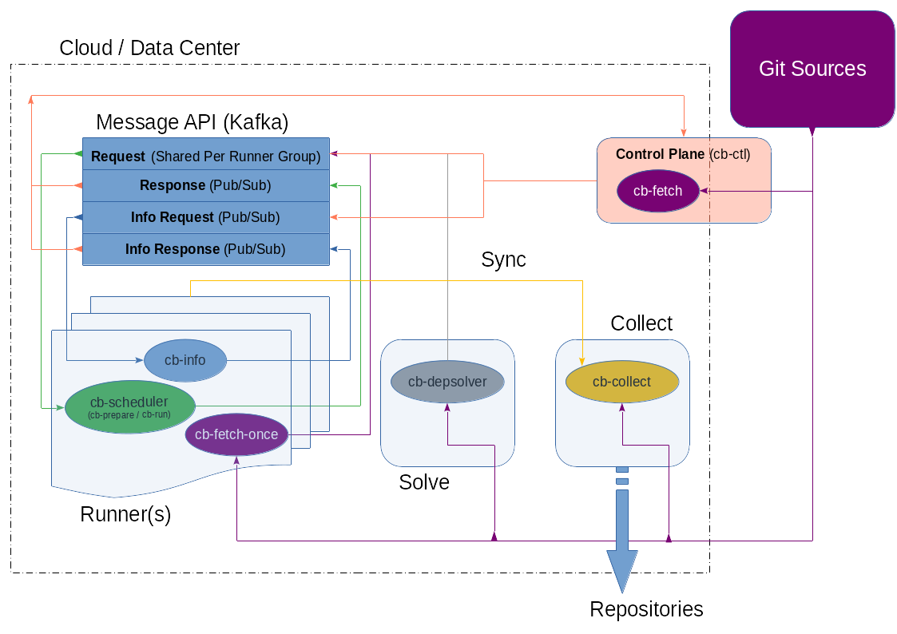

.. _infrastructure-setup:

Infrastructure Setup
====================

The infrastructue setup before setting up the actual
{CB} service instances consists out of two steps:

1. Create a git repository to store the package sources

2. Create a message broker service for the communication
   between {CB} services

The following picture shows how the {CB} services play together
and provides a visual overview about the system.

    Cloud Builder Architecture

.. note::
   Don't be scared about the complexity of the diagram above.
   The architecture as shown there shows a complete landscape
   of a build backend as it could be used to build a Linux
   distribution. The minimal infrastructure to build packages
   with {CB} requires:

   * A git repo with the package sources.
     There is the `cloud-builder-packages <https://github.com/OSInside/cloud-builder-packages>`__
     example repo
   * A Kafka message broker. The focus will be on
     `Amzon MSK <https://docs.aws.amazon.com/msk/latest/developerguide/before-you-begin.html>`__
   * A runner instance.

   As the idea of {CB} is to come up with a scalable system that
   is configurable to the needs of the user, most of the services
   are optional on top of the minimal infrastructure.

Learn how to setup the git package source repository
:ref:`git-package-source-setup`
